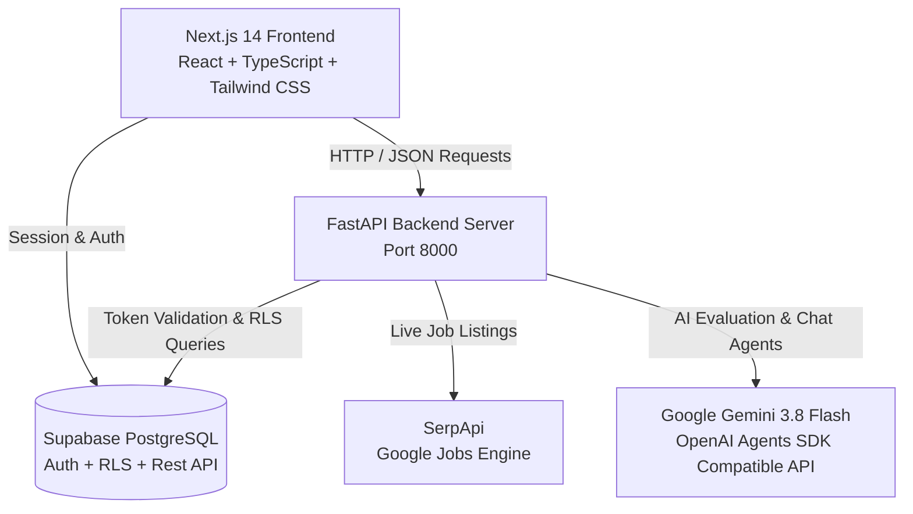

# InternPilot-AI

> **AI-Powered Internship Discovery & Career Preparation Platform for Students**

InternPilot-AI is a full-stack platform designed to bridge the gap between students and career opportunities. It automates internship discovery using live search data, analyzes skill gaps against job market requirements, evaluates resumes, delivers curated learning resources, and provides AI-powered aptitude and interview coaching.

---

## 🚀 Key Features

1. **Live Internship Discovery & Matching**:
   - Real-time search powered by SerpApi (Google Jobs).
   - Candidate eligibility scoring (Entry-Level vs Experience Required vs Review).
   - Keyword and semantic skill match percentages against extracted job requirements.
   - Natural language internship search via the **Internship Discovery AI Agent**.

2. **Resume Analysis & Skill Detection**:
   - Automated technical skill detection from resumes.
   - Word-boundary matching to prevent false positives.
   - Actionable resume enhancement recommendations (projects, metrics, achievements).
   - One-click skill import into the student profile.

3. **Skill-Gap Analysis & Curated Learning**:
   - Compare current skills against target role requirements.
   - Identifies missing required and preferred skills.
   - Generates tailored, curated learning resources and documentation links.

4. **Aptitude Practice & AI Diagnostic Coach**:
   - Practice across Quantitative, Logical Reasoning, Verbal Ability, and Data Interpretation.
   - Immediate answer verification and detailed accuracy analytics.
   - **Aptitude AI Agent** provides personalized feedback, identifying weak areas and study plans.

5. **Interview Preparation & AI Evaluation**:
   - Role-specific technical and behavioral questions (Data Analyst, Data Science, etc.).
   - Interactive practice mode with **Interview Assistance AI Agent**.
   - Scores responses on a 0–10 scale with concrete strengths and improvement pointers.

6. **Application Tracking & Watchlist**:
   - Bookmark internships with deadline tracking.
   - Track application stages (`Applied`, `Shortlisted`, `Interview`, `Selected`, `Rejected`).
   - Backed by Supabase PostgreSQL with strict Row Level Security (RLS).
   - Automated upcoming deadline alerts (`/api/notifications/deadlines`).

---

## 🛠️ Architecture & Tech Stack



- **Frontend**: Next.js 14 (App Router), React 18, TypeScript, Tailwind CSS, Lucide Icons.
- **Backend**: Python 3.11, FastAPI, Uvicorn, Pydantic v2.
- **AI Agent Framework**: OpenAI Agents SDK powered by Google Gemini (`gemini-3.8-flash`).
- **Database & Auth**: Supabase (PostgreSQL with Row Level Security, Supabase Auth).
- **Search Engine**: SerpApi (Google Jobs).

---

## 📋 Prerequisites

- **Node.js**: v18.17.0 or higher
- **Python**: v3.10 or higher
- **Package Managers**: `npm` and `pip`
- Accounts/API Keys (for live features):
  - [Supabase](https://supabase.com/) account (URL & Anon Key)
  - [Google AI Studio](https://aistudio.google.com/) API Key for Gemini
  - [SerpApi](https://serpapi.com/) API Key

---

## ⚙️ Environment Variables

### 1. Root / Backend Environment (`app/backend/.env`)
Copy `app/backend/.env.example` to `app/backend/.env`:
```env
# Server Configuration
ENVIRONMENT=development
PORT=8000

# AI Provider (Gemini 3.8 Flash)
GEMINI_API_KEY=your_gemini_api_key_here

# SerpApi
SERPAPI_API_KEY=your_serpapi_api_key_here

# Supabase Database & Auth
SUPABASE_URL=https://your-project.supabase.co
SUPABASE_KEY=your_supabase_anon_key_here
SUPABASE_SERVICE_ROLE_KEY=your_supabase_service_role_key_here
```

### 2. Frontend Environment (`app/frontend/.env.local`)
Copy `app/frontend/.env.local.example` to `app/frontend/.env.local`:
```env
NEXT_PUBLIC_API_URL=http://127.0.0.1:8000
NEXT_PUBLIC_SUPABASE_URL=https://your-project.supabase.co
NEXT_PUBLIC_SUPABASE_ANON_KEY=your_supabase_anon_key_here
```

---

## 🚀 Getting Started

### 1. Backend Setup

```bash
# Navigate to backend directory
cd app/backend

# Create and activate virtual environment
python -m venv .venv

# Windows:
.venv\Scripts\activate
# Linux/macOS:
# source .venv/bin/activate

# Install dependencies
pip install -r requirements.txt

# Start FastAPI development server
uvicorn app.main:app --host 127.0.0.1 --port 8000 --reload
```

- **API Root**: `http://127.0.0.1:8000/`
- **Swagger Documentation**: `http://127.0.0.1:8000/docs`
- **ReDoc**: `http://127.0.0.1:8000/redoc`

### 2. Frontend Setup

```bash
# Navigate to frontend directory
cd app/frontend

# Install dependencies
npm install

# Start development server
npm run dev
```

- **Web Application**: `http://localhost:3000`

---

## 🗄️ Database Setup (Supabase)

To initialize the database tables and Row Level Security policies:

1. Open your Supabase Project Dashboard and go to the **SQL Editor**.
2. Run the migration scripts in sequential order from `supabase/migrations/`:
   - `001_initial_schema.sql`: Core profiles and skills.
   - `002_internship_schema.sql`: Internships and requirements.
   - `003_aptitude_schema.sql`: Aptitude bank and attempts.
   - `004_applications.sql`: Applications, watchlist, and user constraints.
3. Review `supabase/README.md` for policy verification queries.

---

## 🧪 Testing and Verification

### Backend Automated Tests
All 109 automated backend tests cover authentication, CORS, SerpApi caching, AI error handling, aptitude scoring, and watchlist persistence:

```bash
cd app/backend
# Set PYTHONPATH and run pytest
$env:PYTHONPATH="c:\path\to\InternPilot-AI\app\backend"; .venv\Scripts\pytest -v
```
**Result**: `109 passed`

### Frontend Quality Checks
```bash
cd app/frontend

# Type checking
npx tsc --noEmit

# Code linting
npm run lint

# Production build
npm run build
```
**Result**: 0 TypeScript errors, 0 ESLint errors/warnings, all 14 routes statically optimized.

---

## 🛡️ Security & Reliability

- **Row Level Security (RLS)**: Enforced on all user-scoped tables (`applications`, `watchlist`, `profiles`).
- **Secure Token Handling**: No hardcoded or dummy tokens transmitted. The API client gracefully manages guest vs. authenticated sessions.
- **Defensive Error Handling**: Upstream AI timeouts or 503 errors from external providers are caught and converted to informative client messages.
- **Strict CORS**: CORS restricted to `http://localhost:3000` and `http://127.0.0.1:3000`.

---

## 👥 Hackathon Demonstration Guide

For a live demo, walk through this student journey:
1. **Explore Internships**: Search for "Python Developer" in "India" on `/internships`. Observe live SerpApi listings with match percentages.
2. **Analyze Resume**: Upload or paste resume on `/resume`. Highlight detected skills and one-click import.
3. **Check Skill Gaps**: Open `/skill-gap` to see tailored learning resources for missing skills.
4. **Practice Aptitude**: Solve questions on `/aptitude` and trigger the AI Diagnostic analysis.
5. **Interview Simulation**: Practice an interview question on `/interview` and request AI evaluation for instant feedback.
6. **Track Applications**: Save listings to `/watchlist` and update application statuses on `/applications`.
